# SimpleAgentApp

A generic API tool-calling framework that enables LLMs to invoke external APIs through a standardized schema with ReAct (Reasoning and Acting) loop integration.

## 🚀 Quick Start (One-Liner)

```bash
# Build and run everything
make build && make run
```

That's it! All three services will be running:
- **Frontend**: http://localhost:3000 (Login page)
- **Tool API**: http://localhost:8000/docs
- **Agent API**: http://localhost:8001/docs

## 📋 Prerequisites

1. **Docker** installed (for containerized deployment)
2. **OpenAI API Key** - Get one from [OpenAI](https://platform.openai.com/api-keys)
3. **Node.js** (v14+) and **npm** (for local frontend development only)
4. **Python 3.8+** (for local backend development only)

## 🎯 Installation

### Option 1: Make Commands (Recommended)

```bash
# 1. Clone repository
git clone <repository-url>
cd SimpleAgentApp

# 2. Set up environment
cp .env.example .env
# Edit .env and add your OPENAI_API_KEY

# 3. Build and run
make build
make run

# View logs
make logs

# Stop
make stop
```

### Option 2: Docker One-Liner

```bash
# Build image
docker build -t simpleagentapp .

# Run with API key (all three services: Frontend + Tool API + Agent API)
docker run -d -p 3000:3000 -p 8000:8000 -p 8001:8001 -e OPENAI_API_KEY=
# Then check if the container is running 
docker ps 
# The frontend service should then be available at http://localhost:3000

# Tool API doc available at Tool API:  http://localhost:8000/docs

# Agent API: http://localhost:8001/docs


## 🏗️ Architecture

```mermaid
graph TD
    A[React Frontend<br/>Port 3000<br/>Login & Chat UI] -->|HTTP REST| B[Agent API<br/>Port 8001<br/>FastAPI + OpenAI<br/>LLM Orchestration]
    B -->|Python calls| C[Agent Controller<br/>ReAct Loop<br/>Thought → Action → Observation]
    C -->|HTTP calls| D[Tool API<br/>Port 8000<br/>FastAPI<br/>Tool Endpoints]

    style A fill:#e1f5ff,stroke:#01579b,stroke-width:2px
    style B fill:#f3e5f5,stroke:#4a148c,stroke-width:2px
    style C fill:#fff3e0,stroke:#e65100,stroke-width:2px
    style D fill:#e8f5e9,stroke:#1b5e20,stroke-width:2px
```



## 📡 Usage Examples

### cURL

```bash
# Simple query
curl -X POST "http://localhost:8001/query" \
  -H "Content-Type: application/json" \
  -d '{"query": "What is the weather in Boston?"}'

# With chat history
curl -X POST "http://localhost:8001/query" \
  -H "Content-Type: application/json" \
  -d '{
    "query": "What about tomorrow?",
    "chat_history": [
      {"role": "user", "content": "What is the weather today?"},
      {"role": "assistant", "content": "It is 15°C in Boston."}
    ]
  }'
```

### Python

```python
import requests

# Simple query
response = requests.post(
    "http://localhost:8001/query",
    json={"query": "Convert 'hello world' to uppercase"}
)

result = response.json()
print(f"Answer: {result['answer']}")

# View reasoning steps
for step in result['steps']:
    print(f"{step['step_type']}: {step['description']}")
```

### JavaScript

```javascript
// Using fetch
const response = await fetch('http://localhost:8001/query', {
  method: 'POST',
  headers: {'Content-Type': 'application/json'},
  body: JSON.stringify({
    query: "What's the weather in Boston?",
    use_react: true
  })
});

const result = await response.json();
console.log('Answer:', result.answer);
console.log('Steps:', result.steps.length);
```

## 🎮 Available Commands

### Make Commands

```bash
make help         # Show all commands
make build        # Build Docker image
make run          # Run both services
make run-no-key   # Run tool API only (no OpenAI key)
make stop         # Stop container
make clean        # Remove image and containers
make logs         # View logs
make test         # Run tests
make quick        # Build and run in one command
```

### Docker Commands

```bash
# Build
docker build -t simpleagentapp .

# Run with everything (Frontend + Tool API + Agent API)
docker run -d -p 3000:3000 -p 8000:8000 -p 8001:8001 -e OPENAI_API_KEY=sk-... simpleagentapp

# Run without API key (Frontend + Tool API only)
docker run -d -p 3000:3000 -p 8000:8000 simpleagentapp

# Stop
docker stop $(docker ps -q --filter ancestor=simpleagentapp)

# Logs
docker logs -f <container-id>
```

## 🧪 Testing

```bash
# Run all tests
make test

# Or manually
python tests/test_generic_call.py
python tests/test_agent_controller.py
python tests/test_agent_api.py

# Interactive demo
python tests/test_llm_response.py
```

## 📚 Documentation

- **[frontend/README.md](frontend/README.md)** - Frontend application guide
- **[agent_api/README.md](agent_api/README.md)** - Agent API documentation
- **[agent_controller/README.md](agent_controller/README.md)** - Agent controller documentation
- **[tests/README.md](tests/README.md)** - Testing guide

## 🔧 Configuration

### Environment Variables

| Variable | Required | Default | Description |
|----------|----------|---------|-------------|
| `OPENAI_API_KEY` | Yes* | - | OpenAI API key (*for Agent API) |
| `OPENAI_MODEL` | No | `gpt-4o` | Model to use |
| `MAX_ITERATIONS` | No | `5` | Max tool call iterations |
| `USE_REACT` | No | `true` | Enable ReAct reasoning |
| `TOOL_REGISTRY_PATH` | No | `./tool_registry` | Tool definitions path |

### .env File

```bash
# Copy template
cp .env.example .env

# Edit and add your API key
OPENAI_API_KEY=sk-...
OPENAI_MODEL=gpt-4o
MAX_ITERATIONS=5
USE_REACT=true
```

## 🛠️ Components

### Frontend (`frontend/`)
React-based web application providing user authentication and chat interface.

**Features:**
- User authentication with role-based access
- Interactive chat with AI agent
- Admin panel for user management
- ReAct reasoning visualization
- Responsive design

**Default Login:**
- Admin: `admin` / `AdminPass123!`
- User: `demo_user` / `UserPass123!`

### Agent API (`agent_api/`)
FastAPI REST API providing HTTP endpoints for LLM queries with chat history support.

**Endpoints:**
- `POST /query` - Process queries
- `GET /health` - Health check
- `GET /tools` - List available tools
- `GET /docs` - API documentation

### Agent Controller (`agent_controller/`)
Python module implementing ReAct loop for intelligent tool selection and execution.

**Features:**
- ReAct methodology (Reasoning → Acting)
- Automatic tool selection
- Multi-step reasoning
- Complete execution traces

### Tool API (`tool_api/`)
FastAPI service providing actual tool endpoints (weather, uppercase, etc.).

### Tool Registry (`tool_registry/`)
JSON definitions of available tools with schemas and descriptions.

### Generic Call (`function_call/`)
Pydantic-based schema and execution engine for API calls.

## 🌟 Features

- ✅ **One-Command Startup** - `make build && make run`
- ✅ **React Frontend** - Complete web UI with authentication and chat
- ✅ **User Management** - Role-based access control (Admin/User)
- ✅ **REST API** - HTTP interface for LLM queries
- ✅ **Chat History** - Conversational context support
- ✅ **ReAct Loop** - Transparent reasoning traces
- ✅ **Docker Support** - Easy deployment with all services
- ✅ **Interactive Docs** - Swagger UI included
- ✅ **CORS Enabled** - Frontend integration
- ✅ **Health Monitoring** - Service status checks
- ✅ **Comprehensive Tests** - Full test coverage

## 🐛 Troubleshooting

### Port already in use
```bash
# Kill processes on ports 3000, 8000, and 8001
lsof -ti:3000,8000,8001 | xargs kill -9
```

### Container won't start
```bash
# Check logs
make logs

# Or
docker logs <container-id>
```

### OpenAI API errors
```bash
# Verify API key is set
docker exec simpleagentapp env | grep OPENAI_API_KEY

# Check health
curl http://localhost:8001/health
```

### Need to rebuild
```bash
make clean
make build
```


**Quick Start Reminder:**
```bash
make build && make run
```

That's all you need! 🚀
